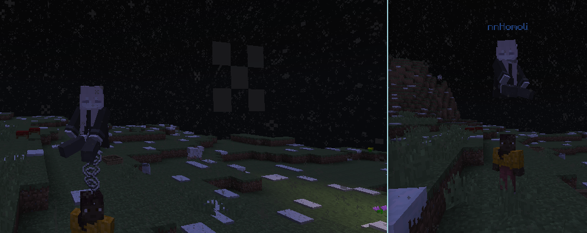
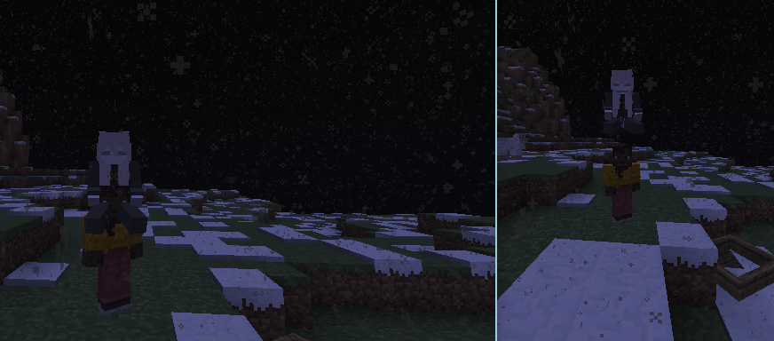

# SyncMyRide


This mod is intended for "[Better Than Adventure!](https://www.betterthanadventure.net/)" fork-mod 

While there could be better implementation by modding both client & server, this one is oriented to be handled by server only

Because of the above, it can affect performance a bit

## Features

- Players now receive vehicle packets when they load a new entity
- Ride Height synchronization by using dummies
- The client now handles riding itself, resulting in no delay between movements
- Better workaround for PacketSetRiding not accepting null
- Cast exception fix when player tries to ride, but vehicle wasn't set as predicted 
- Other small related improvements

<small>Also possibly support for entity as passenger, but untested</small>


## Config

```
vehicle-delay=int
```
Delay after which the server will send an initial vehicle update to the player for the new entity

By default, this value is 5
```
dummy-id=int
```
Item ID that dummies are using to fill the gaps

By default, this value is 16415, which is a "String" item

## Gallery



